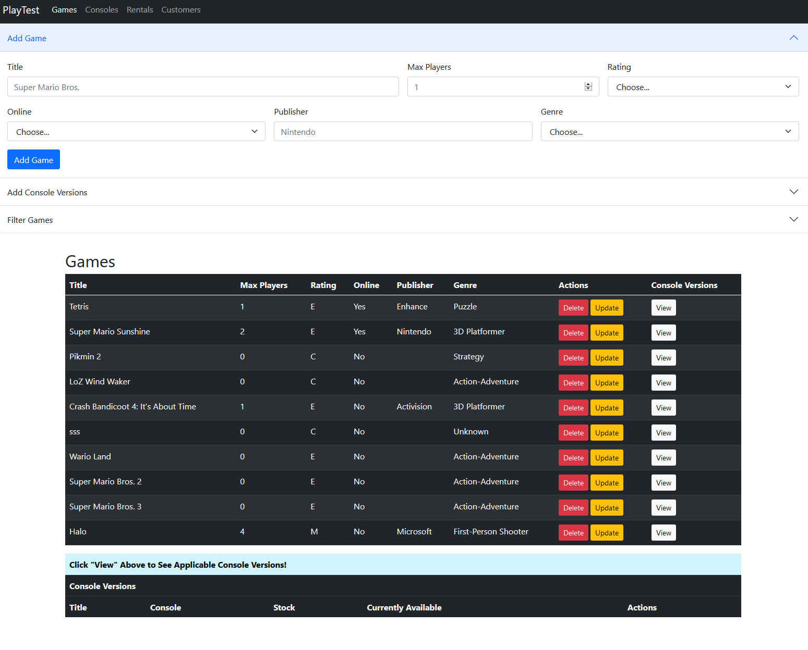

# PlayTest
## A Flask-based CRUD App

This CRUD App simulates a fictional Blockbuster-like rental shop for video games, written in Python using **Flask** and **Jinja2** templating and styled using **Bootstrap 5**. Users can Create, Read, Update, and Delete
Games, Consoles, Rentals, and Customers to simulate managing inventory and rental orders. Furthermore, two intermediate tables that handle Games per specific consoles and Games per rental order 
allow users to customize all aspects of the store's business to their desirability.

## Set-Up and Specs

This site requires MySQL as well as Python 3 and its Flask framework (namely flask-mysqldb). You will also need to go into the `./database/db_credentials.py` to link the host for your database to your liking. 
Once that is all done, you should be able to run the site using gunicorn.

## How PlayTest Works

The homepage leads to all four of the main tables, where you can create, read, update, and delete all of the elements for each individually.

### Games Page

On the Games page, the upper accordion tab, "Add Game", will allow you to add Games via the included form. 
The next tab, "Add Console Versions", allows the user to add copies of the game for each console on which it is available via its form. 
The final tab, "Filter Games", allows the user to filter the table of games via its included form.

The table will list all of the information for each individual Game element. The "Actions" column allows users to update and delete rows. The final column, "Console Versions", 
will display the hidden table at the bottom of the page, which will reveal each console version for the selected game.

### Consoles Page

The Consoles page functions identically to the Games page, although it handles information regarding Consoles and not Games. The accordion tabs are identitcal, and the tables are similar. However, the final tab, "Console Versions", 
now reveals the rows of games that are specific to the chosen console in the hidden bottom table.

### Rentals Page

The Rentals page's upper accordion tab, "Add Rental", functions similarly to the similar tabs on the above two pages, however, it requires a Customer to be linked to in order for it to be added. The next tab, "Add Game Rental", allows users to add Consoles Versions of Games to Rental Orders. 
If a game is out of stock or the customer is too young for the game, it will not be added. The last tab filters rentals much like games and consoles.

The Rentals table is unique in that it uses dates and the quantity of Game's linked to the order to conduct calculations via MySQL. Rentals are initially for 3 days and cost 4.99 per game. However, each day past that in which the order is not returned incurs a late fee cost of 1.99 per game. 
The columns "Item(s) Price", "Days Late", "Late Fee", and "Total" handle these calculations. Lastly, the Game Rentals column allows users to reveal rows containing games linked to the given rental order in the hidden table below.

### Customers Page

The Customers Page is the simplest page of all. Its two tabs, "Add Customer" and "Filter Customers", function as expected. The table shows Customer information and the hidden table below showss all Games rented by a given customer.

## Enjoy!